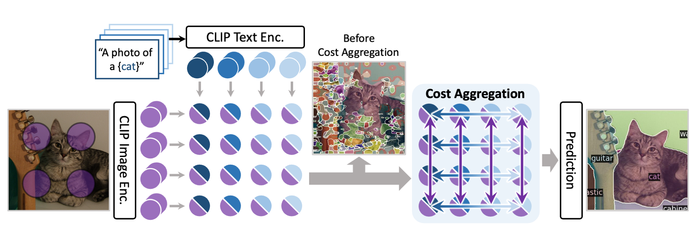

[](https://paperswithcode.com/sota/open-vocabulary-semantic-segmentation-on-2?p=cat-seg-cost-aggregation-for-open-vocabulary)<br>
[](https://paperswithcode.com/sota/open-vocabulary-semantic-segmentation-on-3?p=cat-seg-cost-aggregation-for-open-vocabulary)<br>
[](https://paperswithcode.com/sota/open-vocabulary-semantic-segmentation-on-7?p=cat-seg-cost-aggregation-for-open-vocabulary)<br>
[](https://paperswithcode.com/sota/open-vocabulary-semantic-segmentation-on-1?p=cat-seg-cost-aggregation-for-open-vocabulary)<br>
[](https://paperswithcode.com/sota/open-vocabulary-semantic-segmentation-on-5?p=cat-seg-cost-aggregation-for-open-vocabulary)


# CAT-Seg: Cost Aggregation for Open-Vocabulary Semantic Segmentation [CVPR 2024 Highlight]
This is our official implementation of CAT-Seg! 

[[arXiv](https://arxiv.org/abs/2303.11797)] [[Project](https://ku-cvlab.github.io/CAT-Seg/)] [[HuggingFace Demo](https://huggingface.co/spaces/hamacojr/CAT-Seg)] [[Segment Anything with CAT-Seg](https://huggingface.co/spaces/hamacojr/SAM-CAT-Seg)]<br>

by [Seokju Cho](https://seokju-cho.github.io/)\*, [Heeseong Shin](https://github.com/hsshin98)\*, [Sunghwan Hong](https://sunghwanhong.github.io), [Anurag Arnab](https://anuragarnab.github.io), [Paul Hongsuck Seo](https://phseo.github.io), [Seungryong Kim](https://cvlab.korea.ac.kr)

## Introduction

We introduce cost aggregation to open-vocabulary semantic segmentation, which jointly aggregates both image and text modalities within the matching cost.

For further details and visualization results, please check out our [paper](https://arxiv.org/abs/2303.11797) and our [project page](https://ku-cvlab.github.io/CAT-Seg/).

**❗️Update:** We released the code and pre-trained weights for CVPR version of CAT-Seg! 
Some major updates are:
- We now solely utilize CLIP as the pre-trained encoders, without additional backbones (ResNet, Swin)!
- We also fine-tune the text encoder of CLIP, yielding significantly improved performance!

For further details, please check out our updated [paper](https://arxiv.org/abs/2303.11797).
Note that the demos are still running on our previous version, and will be updated soon!

## :fire:TODO
- [x] Train/Evaluation Code (Mar 21, 2023)
- [x] Pre-trained weights (Mar 30, 2023)
- [x] Code of interactive demo (Jul 13, 2023)
- [x] Release code for CVPR version (Apr 4, 2024)
- [x] Release checkpoints for CVPR version (Apr 11, 2024)
- [ ] Demo update

## Installation
Please follow [installation](INSTALL.md). 

## Data Preparation
Please follow [dataset preperation](datasets/README.md).

## Demo
If you want to try your own images locally, please try [interactive demo](https://github.com/KU-CVLAB/CAT-Seg/tree/demo).

## Training
We provide shell scripts for training and evaluation. ```run.sh``` trains the model in default configuration and evaluates the model after training. 

To train or evaluate the model in different environments, modify the given shell script and config files accordingly.

### Training script
```bash
sh run.sh [CONFIG] [NUM_GPUS] [OUTPUT_DIR] [OPTS]

# For ViT-B variant
sh run.sh configs/vitb_384.yaml 4 output/
# For ViT-L variant
sh run.sh configs/vitl_336.yaml 4 output/
```

## Evaluation
```eval.sh``` automatically evaluates the model following our evaluation protocol, with weights in the output directory if not specified.
To individually run the model in different datasets, please refer to the commands in ```eval.sh```.

### Evaluation script
```bash
sh run.sh [CONFIG] [NUM_GPUS] [OUTPUT_DIR] [OPTS]

sh eval.sh configs/vitl_336.yaml 4 output/ MODEL.WEIGHTS path/to/weights.pth
```

## Pretrained Models
We provide pretrained weights for our models reported in the paper. All of the models were evaluated with 4 NVIDIA RTX 3090 GPUs, and can be reproduced with the evaluation script above.

<table><tbody>
<!-- START TABLE -->
<!-- TABLE HEADER -->
<th valign="bottom">Name</th>
<th valign="bottom">CLIP</th>
<th valign="bottom">A-847</th>
<th valign="bottom">PC-459</th>
<th valign="bottom">A-150</th>
<th valign="bottom">PC-59</th>
<th valign="bottom">PAS-20</th>
<th valign="bottom">PAS-20b</th>
<th valign="bottom">Download</th>
<!-- TABLE BODY -->
<!-- ROW: CAT-Seg (B) -->
<tr>
<td align="left">CAT-Seg (B)</a></td>
<td align="center">ViT-B/16</td>
<td align="center">12.0</td>
<td align="center">19.0</td>
<td align="center">31.8</td>
<td align="center">57.5</td>
<td align="center">94.6</td>
<td align="center">77.3</td>
<td align="center"><a href="https://huggingface.co/spaces/hamacojr/CAT-Seg-weights/resolve/main/model_base.pth">ckpt</a>&nbsp;
</tr>
<!-- ROW: CAT-Seg (L) -->
<tr>
<td align="left">CAT-Seg (L)</a></td>
<td align="center">ViT-L/14</td>
<td align="center">16.0</td>
<td align="center">23.8</td>
<td align="center">37.9</td>
<td align="center">63.3</td>
<td align="center">97.0</td>
<td align="center">82.5</td>
<td align="center"><a href="https://huggingface.co/spaces/hamacojr/CAT-Seg-weights/resolve/main/model_large.pth">ckpt</a>&nbsp;
</tr>

</tbody></table>


## Acknowledgement
We would like to acknowledge the contributions of public projects, such as [Zegformer](https://github.com/dingjiansw101/ZegFormer), whose code has been utilized in this repository.
We also thank [Benedikt](mailto:benedikt.blumenstiel@student.kit.edu) for finding an error in our inference code and evaluating CAT-Seg over various datasets!
## Citing CAT-Seg :cat::pray:

```BibTeX
@misc{cho2024catseg,
      title={CAT-Seg: Cost Aggregation for Open-Vocabulary Semantic Segmentation}, 
      author={Seokju Cho and Heeseong Shin and Sunghwan Hong and Anurag Arnab and Paul Hongsuck Seo and Seungryong Kim},
      year={2024},
      eprint={2303.11797},
      archivePrefix={arXiv},
      primaryClass={cs.CV}
}
```
